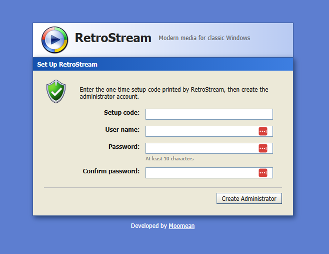
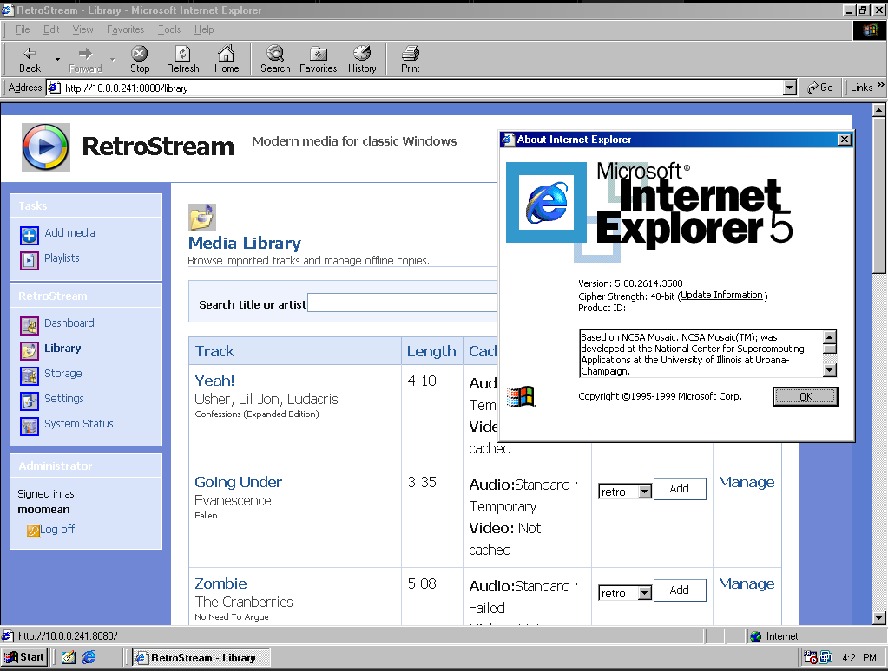
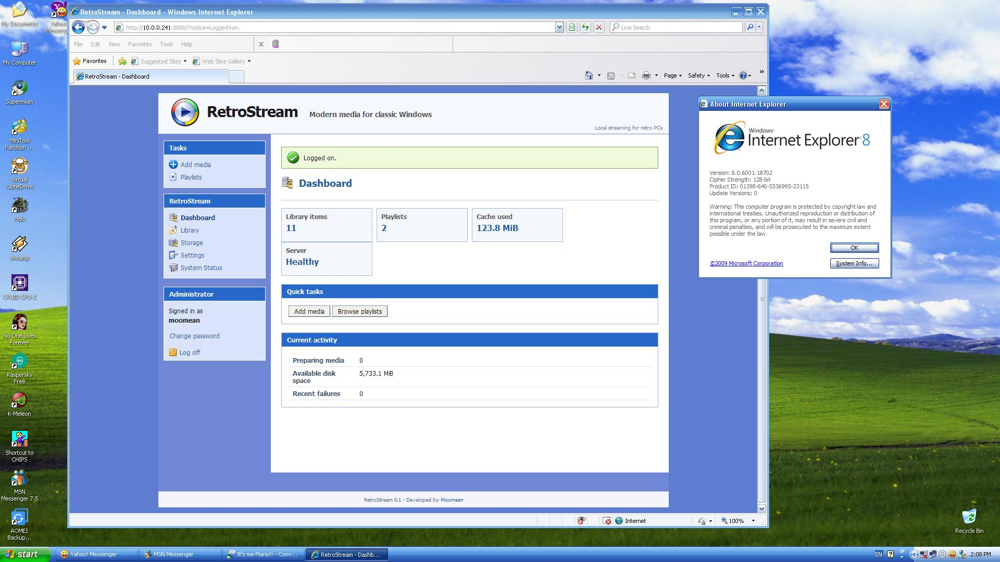
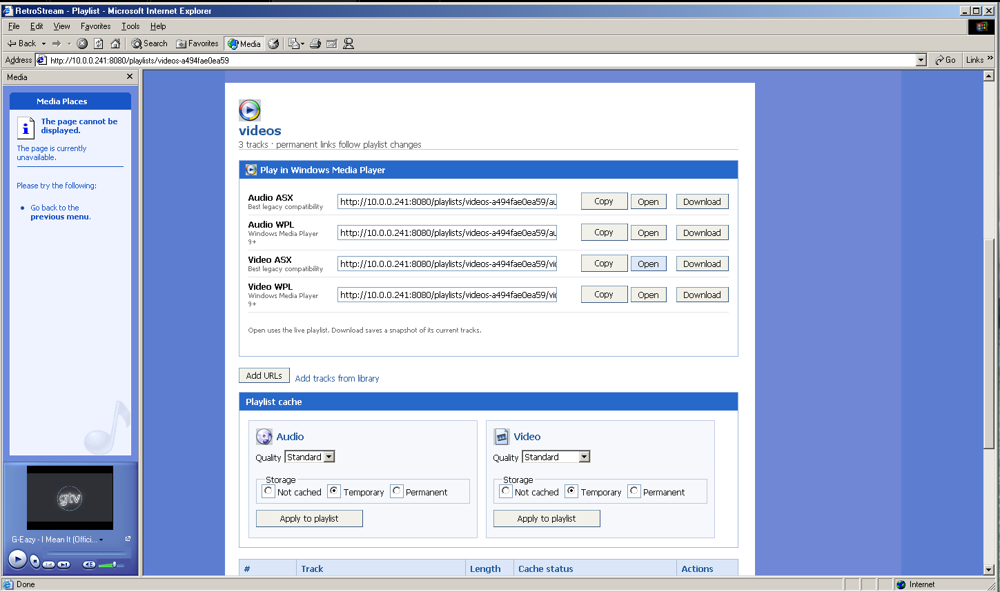
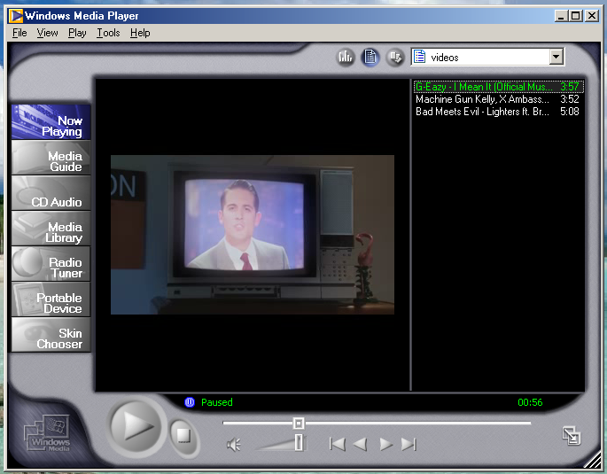
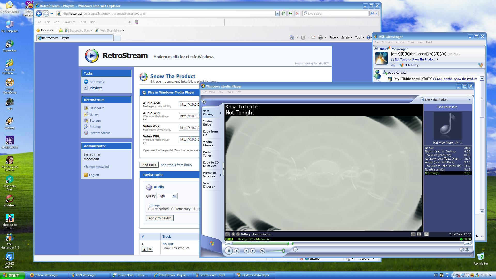
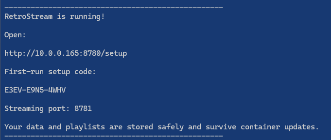
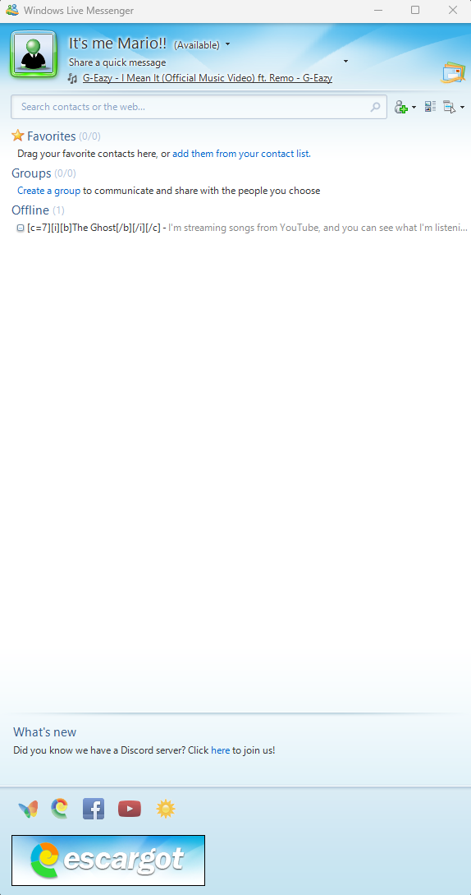

# RetroStream

RetroStream turns modern YouTube media into Windows Media formats that classic
Windows PCs can play across your local network.

```text
YouTube → RetroStream Docker app → Windows Media Player on your LAN
```

It provides a Windows XP-style management page, persistent playlists, permanent
ASX/WPL links, and WMA/WMV preparation using FFmpeg. The Docker app includes
Python, FFmpeg, yt-dlp, Deno, and SQLite; you do not install them separately.

> RetroStream is designed for a trusted home LAN. Do not expose its ports to the
> public Internet.

## RetroStream Tutorial – Installation & Usage

[Watch the RetroStream installation and usage tutorial on YouTube](https://www.youtube.com/watch?v=A2ji2uFi_Ks)

## Screenshots

The interface is intentionally styled after the Windows XP Luna era and remains
usable in older browsers.

### First-run administrator setup



### Classic browser compatibility

| Internet Explorer 5 library view | Internet Explorer 8 dashboard |
| --- | --- |
|  |  |

### Playlist controls and playback

| Playlist controls in Internet Explorer | Video playing in Windows Media Player 7 |
| --- | --- |
|  |  |



> These retro-client captures come from an existing installation explicitly
> configured for the former port 8080. New Docker installations use 8780 for the
> web interface and playlists and 8781 for media streaming.

## What you need

These are practical starting points. Transcoding speed and storage use depend on
media quality, playlist size, and the number of simultaneous users.

### Minimum requirements

- A 64-bit x86-64 (`amd64`) computer or NAS that can run Docker. The published
  container does not currently support ARM systems.
- 2 CPU cores and 2 GB of available RAM.
- 5 GB of free disk space for Docker, RetroStream data, and a small media cache.
- Docker Desktop on Windows/macOS, or Docker Engine with the Docker Compose plugin
  on Linux.
- A browser for administration and a compatible media player on the retro PC.
  RetroStream remains usable in older browsers.
- A local network connection between the retro PC and Docker host, with TCP ports
  **8780** and **8781** allowed through the host firewall.

### Recommended for the best experience

- 4 or more CPU cores and at least 4 GB of available RAM; 8 GB is preferable when
  preparing multiple files or serving several clients at once.
- 25 GB or more of free disk space, which comfortably accommodates the default
  20 GiB prepared-media cache.
- A wired Ethernet connection and an always-on Docker host.
- A modern browser for the best administration experience.
- A reserved LAN IP address or stable local DNS name for the RetroStream host, so
  saved playlist links keep working.

No Internet port forwarding is required or recommended.

## Step-by-step installation

### 1. Install Docker

**Windows or macOS:** install Docker Desktop from Docker's official website, start
it, and wait until Docker reports that it is running.

**Linux:** install Docker Engine and the Docker Compose plugin using Docker's
instructions for your distribution. Confirm your account can run `docker info`.

RetroStream never installs Docker or makes privileged package-manager changes for you.

### 2. Download RetroStream

On this GitHub page, select **Code → Download ZIP**. Extract the ZIP to a permanent
folder. Do not run the setup helper from inside the ZIP preview.

Advanced users may clone the repository instead:

```sh
git clone https://github.com/moomean712/RetroStream.git
cd RetroStream
```

### 3. Run the setup helper

On Linux or macOS, open a terminal in the extracted `RetroStream` folder and run:

```sh
./install-docker.sh
```

If the extracted file is not executable, use:

```sh
sh install-docker.sh
```

On Windows, open PowerShell in the extracted folder and run:

```powershell
powershell -ExecutionPolicy Bypass -File .\install-docker.ps1
```

That execution-policy option applies only to this one command.

### 4. Confirm the LAN address

The helper detects a likely address and asks:

```text
Detected LAN address: 192.168.1.50

How will your retro PCs reach this server?
[192.168.1.50]:
```

Press Enter if the detected address is correct. Otherwise enter the reserved LAN IP
or DNS name your retro PCs use, such as `retrostream.home.arpa`. Do not enter
`http://`, a port, `localhost`, `127.0.0.1`, or a Docker container name.

The helper then downloads the RetroStream image, starts it, waits for it to become
healthy, and prints the setup address and one-time administrator code.

### 5. Create the administrator



_Example installer output; your server address and one-time setup code will differ._

Open the printed address in a modern browser, normally:

```text
http://YOUR-SERVER:8780/setup
```

Enter the setup code printed by the helper and create the administrator account.
The plaintext code is not stored in the database and stops working after setup.

If the helper could not display the code, run:

```sh
docker compose logs retrostream
```

## How to use RetroStream

RetroStream lets modern YouTube and YouTube Music content play on older media
players by converting it into legacy-friendly Windows Media formats.

### 1. Open RetroStream

From a modern browser on your network, open the RetroStream web interface:

```text
http://YOUR-SERVER:8780
```

Log in with the administrator account you created during setup.

### 2. Add media

Open **Add Media** and paste a supported YouTube or YouTube Music link.

RetroStream can import:

- individual videos or songs
- YouTube playlists
- YouTube Music playlists
- YouTube Music albums

Playlists must be **public or unlisted**. Private playlists cannot be imported.

After submitting the link, RetroStream imports the tracks into your library.

### 3. Create a playlist

Open **Playlists** and create a playlist. You can then add imported tracks from
your library, change their order, or import media directly into a playlist.

Each playlist gets a permanent RetroStream URL, so you can reuse the same playlist
from your retro computers later.

### 4. Prepare media

RetroStream converts modern media into formats older players understand. For audio,
choose an Audio quality. For video, choose:

- **Low (Legacy)** — WMV1, intended for very old Windows Media Player versions
- **Standard** — WMV2
- **High** — WMV2 at higher quality

You can prepare tracks manually, prepare an entire playlist, or allow RetroStream
to generate media when needed.

### 5. Play on another computer

Open the playlist's **ASX** or **WPL** link, or download either playlist file and
open it with a compatible media player.

RetroStream has been tested successfully with:

- Windows Media Player
- VLC
- Winamp

The player connects back to RetroStream over your LAN and streams the converted
audio or video. Playback controls remain inside the media player, including
**Play, Pause, Seek, Next, Previous, Shuffle, and Repeat**.

### 6. Keep RetroStream running

The RetroStream server must remain running while your retro computers are streaming
from it. Your library, playlists, administrator account, and prepared media are
stored persistently, so normal Docker restarts and updates do not erase them.

> RetroStream is intended for use on a trusted local network. Do not expose ports
> 8780 or 8781 directly to the public Internet.

## MSN / Windows Live Messenger “Now Playing”

One of RetroStream's fun retro-era features is that it can work with the old
**MSN Messenger / Windows Live Messenger “Show What I'm Listening To”** feature.

When you play RetroStream audio in a compatible version of **Windows Media
Player**, RetroStream embeds normal Windows Media metadata such as the track title
and artist into the WMA/WMV stream. Windows Media Player can then expose that
metadata to Messenger through its normal “Now Playing” integration.

If your Messenger version and Windows Media Player setup support it, your personal
status can automatically show something like:

```text
Artist - Song Title
```

while the track is playing.



RetroStream does not modify or communicate with Messenger directly. It simply
provides properly tagged Windows Media streams and lets the original Windows Media
Player/Messenger integration do the rest.

For the best chance of compatibility:

- Use Windows Media Player on the retro PC.
- Enable **Show What I'm Listening To** in MSN/Windows Live Messenger.
- Make sure Messenger's Windows Media Player integration or plugin is enabled.
- Play a RetroStream audio playlist normally through Windows Media Player.

This is especially useful if you're running a restored MSN/Windows Live Messenger
setup and want the full mid-2000s experience.

## Your data is persistent

RetroStream stores important state separately from the replaceable app:

- `retrostream-data`: administrator, sessions, settings, library, playlists, slugs,
  and SQLite database.
- `retrostream-cache`: prepared WMA/WMV files and temporary media work.

Normal stops, restarts, and updates do not remove these stores.

## Everyday commands

Run commands from the extracted RetroStream folder:

```sh
# Start
docker compose up -d

# Stop
docker compose down

# Show status
docker compose ps

# Follow logs (Ctrl+C stops watching; it does not stop RetroStream)
docker compose logs -f retrostream

# Restart
docker compose restart retrostream
```

Do not add `-v` to normal stop or update commands. Removing volumes deletes data.

## Update RetroStream

Linux/macOS:

```sh
./update-docker.sh
```

Windows PowerShell:

```powershell
.\update-docker.ps1
```

The helper downloads the latest image, recreates the app, runs database migrations,
waits for health, and preserves both data stores.

## Back up and restore

Create a consistent timestamped backup of important `/data` state:

```sh
./backup-docker.sh
```

Windows PowerShell:

```powershell
.\backup-docker.ps1
```

The helper pauses RetroStream briefly while copying the SQLite state, then starts it
again. Add `--include-cache` on Linux/macOS or `-IncludeCache` on Windows to include
prepared media. Backups are written below `backups/` and contain sensitive account
and session state, so keep them private.

To restore a compatible backup:

```sh
docker compose stop retrostream
docker compose cp backups/retrostream-YYYYMMDD-HHMMSS/data/. retrostream:/data
docker compose start retrostream
docker compose logs retrostream
```

Keep a copy of the current state before restoring an older backup.

## Troubleshooting

### RetroStream does not open

Run `docker compose ps`. The service should show `healthy`. Then inspect
`docker compose logs retrostream`.

### My retro PC cannot connect

Check all of the following:

- `RETROSTREAM_HOSTNAME` in `.env` is the address used by the retro PC.
- The retro PC can resolve that name or reach that IP.
- The server firewall allows trusted-LAN TCP traffic to **8780** and **8781**.
- Wi-Fi isolation, guest networks, or VLAN rules are not blocking the connection.
- The generated ASX media references use the LAN address and port 8781.

### My server IP changed

Edit `RETROSTREAM_HOSTNAME` in `.env`, then run:

```sh
docker compose up -d --force-recreate retrostream
```

Dynamic playlist links immediately use the new address. Previously downloaded ASX
files still contain the old address and must be downloaded again.

### Will updating delete playlists?

No. The update helpers preserve the Docker data and cache stores.

### Docker says the image is unauthorized or not found

The GitHub Container Registry package must be public and the `latest` workflow must
have completed successfully. Check this repository's **Actions** and **Packages** pages.

## Configuration

The installer creates `.env`. Most users only need:

```dotenv
RETROSTREAM_HOSTNAME=192.168.1.50
RETROSTREAM_WEB_PORT=8780
RETROSTREAM_STREAMING_PORT=8781
```

Optional settings are documented in [.env.example](.env.example):

- cache size and retention
- default audio/video quality
- maximum simultaneous transcodes and streams
- a pinned image version

New installations use ports 8780/8781. Existing explicit 8080/8081 settings remain
valid and are not silently rewritten by the installer.

## Build locally for development

Normal users should use the published image. Developers can build the current source:

```sh
docker compose -f compose.yaml -f compose.build.yaml up -d --build
```

Run the Python test suite with:

```sh
python -m pip install -e '.[test]'
python -m pytest -q
python -m ruff check retrostream tests
python -m ruff format --check retrostream tests
```

The GitHub workflow builds the image, starts Compose, tests health and both listeners,
checks FFmpeg WMAv2/WMV1/WMV2 and ASF support, performs synthetic media encodes, tests
volume persistence across recreation, and publishes successful `main` builds to:

```text
ghcr.io/moomean712/retrostream:latest
```

## Security and scope

- One administrator account; this is not a multi-user hosted service.
- Intended for trusted LAN use only.
- No DRM bypass and no public Internet exposure.
- No nginx, database server, Redis, queue service, or supervisor in the image.
- One non-root RetroStream process; persistent writes are limited to `/data` and `/cache`.

## Disclosure

RetroStream was **conceived, planned, designed, prompted, tested, debugged, deployed,
and validated by a human**.

AI tools were used to write the code based on those human-created requirements,
architecture decisions, prompts, and testing feedback. The resulting code was then
reviewed, tested on real systems, debugged, refined, and maintained by the human
developer.

## Disclaimer

RetroStream is an open-source compatibility and educational project developed
primarily for personal use, experimentation, and the preservation of legacy media
playback workflows on vintage computer systems.

- **No Content Affiliation:** RetroStream does not host, provide, bundle, or
  distribute copyrighted media content. Media is retrieved and processed only at
  the direction of the user. RetroStream is not affiliated with, endorsed by, or
  sponsored by YouTube, Google, Microsoft, or any other third-party platform or
  rights holder.
- **Third-Party Services:** RetroStream interacts with third-party services and
  publicly accessible media endpoints, including YouTube and YouTube Music. Use of
  this software may be subject to, or potentially conflict with, the terms and
  policies of those services. The developer is not responsible for rate limiting,
  access restrictions, account actions, IP blocking, or other consequences
  resulting from use of the software.
- **Copyright and User Responsibility:** Users are solely responsible for ensuring
  that their use of RetroStream complies with applicable copyright laws, licensing
  terms, and the intellectual property rights of content owners.
- **No Circumvention:** RetroStream is not intended to bypass DRM, access controls,
  paywalls, authentication requirements, or other technological protection
  measures.

## License

RetroStream source is provided under the [MIT License](LICENSE). FFmpeg, yt-dlp,
Deno, Python dependencies, and supplied visual assets retain their own licenses.
